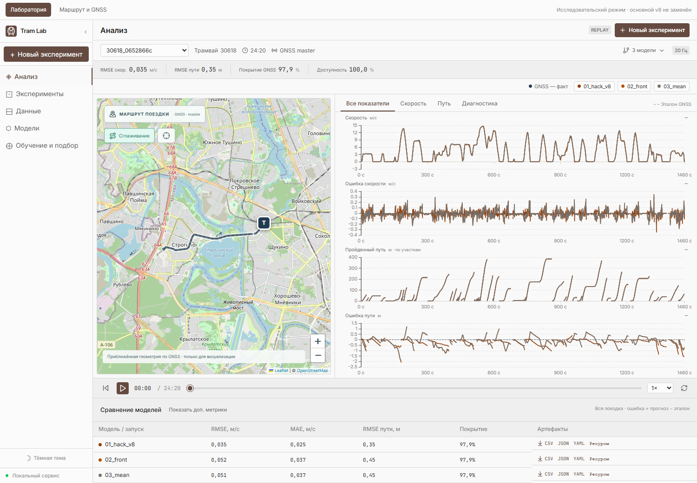

# Инструкция по проверке

## Сначала — посмотреть результат

В **Tram Odometry Lab** можно выбрать поездку, сравнить v8 с базовыми моделями на общей шкале времени, посмотреть карту и ошибки, добавить пропуски колёсных данных и выгрузить CSV.



На скриншоте v8 выбран первым: верхние показатели относятся к нему. Это одна development-запись `30618_0652866c`; общие результаты validation приведены в отдельном отчёте.

**[Запуск UI и короткий сценарий демонстрации](WEB_DEMO.md)** · **[Точность и задержка v8](VALIDATION_V8.md)**

Для быстрого знакомства: открыть development-запись `30618_0652866c`, сравнить `hack_v8`, `front` и `mean`, затем создать отдельный эксперимент с пропуском колёсных измерений. Интерфейс работает с записями офлайн; ниже приведена проверка выходов ROS-ноды.

## 1. Среда и сборка

Ubuntu 22.04, ROS 2 Humble, Python 3, `colcon`, пакеты `nav_msgs`, `diagnostic_msgs`, `std_srvs`, `launch_ros` и `ament_index_python`. Зависимости устанавливаются заранее; сборка проекта не скачивает данные или модели. Рецепт подготовки контейнера: [Dockerfile.environment](../Dockerfile.environment).

Получить исходники и официальные записи (нужен интернет; загрузка данных выполняется один раз):

```bash
git clone https://github.com/jabrailkhalil/hack.git
cd hack
python3 tools/get_dataset.py
```

Если репозиторий уже скачан, выполнить только последнюю команду из его корня. Скрипт проверяет SHA256 архива и распаковывает rosbag в `dataset/data`. Для короткой демонстрации ниже используется development-запись `30618_0652866c`.

Из корня репозитория:

```bash
bash submission/build.sh
```

Скрипт собирает `tram_vehicle_msgs` и `reserve_odometry`, затем запускает тесты. Эквивалент самой сборки:

```bash
source /opt/ros/humble/setup.bash
colcon --log-base log_main build --base-paths src   --build-base build_main --install-base install_main --executor sequential
source install_main/setup.bash
```

Устанавливаются `guarded_odometry_node`, `odometry.launch.py` и `champion_v8.yaml`.

## 2. Воспроизведение rosbag

В первом терминале:

```bash
bash submission/run.sh --clock 2>&1 | tee /tmp/reserve-odometry.log
```

Во втором терминале, из корня репозитория:

```bash
source /opt/ros/humble/setup.bash
source install_main/setup.bash
ros2 bag info dataset/data/30618_0652866c
ros2 bag play dataset/data/30618_0652866c --clock 100 --topics   /vehicle/driver_position_cmd   /vehicle/front_bogie_velocity   /vehicle/rear_bogie_velocity
```

Для другой поездки заменить путь на её каталог rosbag с `metadata.yaml` и файлом `.db3`. Режим `ros_clock` позволяет продолжать прогноз при исчезновении всех трёх входов, пока поступает `/clock`. Пауза воспроизведения останавливает модельное время; перемотка назад начинает новый относительный сегмент. Перед каждой независимой записью перезапустить ноду.

Для обычного потока без `/clock` используется `bash submission/run.sh`: время продвигается по меткам входных сообщений (`input_stamp`). При полном исчезновении входов этот режим не продвигает расчёт.

## 3. Топики

| Направление | Топик | Тип | Поле и единицы |
|---|---|---|---|
| Вход | `/vehicle/driver_position_cmd` | `tram_vehicle_msgs/msg/DriverControllerCommand` | `position`, −15…15: торможение / нейтраль / тяга |
| Вход | `/vehicle/front_bogie_velocity` | `tram_vehicle_msgs/msg/VelocitySensor` | `velocity`, масштаб `front_scale` |
| Вход | `/vehicle/rear_bogie_velocity` | `tram_vehicle_msgs/msg/VelocitySensor` | `velocity`, масштаб `rear_scale` |
| Выход | `/result/velocity` | `tram_vehicle_msgs/msg/VelocitySensor` | `velocity`, м/с; `frame_id=base_link` |
| Выход | `/result/position` | `nav_msgs/msg/Odometry` | `pose.pose.position`, м; скорость в `twist.twist.linear.x` |
| Выход | `/result/diagnostics` | `diagnostic_msgs/msg/DiagnosticArray` | состояние фильтра, причины отклонения данных, счётчики |

У входов QoS best-effort, глубина 64. Оба основных выхода имеют метку времени данных и частоту расчёта 20 Гц. В режиме без карты `frame_id=odom_path_1d`, `child_frame_id=base_link`, позиция `(s,0,0)`. Публикация начинается после получения пригодной пары колёсных показаний.

В профиле масштабы колёс равны `1/3.6`. Это эмпирическая настройка предоставленного набора: если проверочные входы уже в м/с, оба масштаба требуется явно заменить на `1.0` в копии YAML.

## 4. Результаты и диагностика

В дополнительном терминале подключить `/opt/ros/humble/setup.bash` и `install_main/setup.bash`, затем выполнять команды по отдельности:

```bash
ros2 topic echo /result/velocity --once
ros2 topic echo /result/position --once
ros2 topic hz /result/velocity
ros2 topic hz /result/position
ros2 topic echo /result/diagnostics
```

Основные поля диагностики: `front_status`, `rear_status`, `command_stale`, `invalid_messages`, `buffer_dropped`, `backward_clock_resets`, `callback_compute_ms`, `position_mode`. `MISSING_OR_STALE`, `RATE_ANOMALY` и другие статусы объясняют исключение колёсных показаний. `callback_compute_ms` измеряет вычисление callback и не заменяет задержку от входа до результата. Предупреждение о `relative_1d` ожидаемо при работе без карты.

Для записи результатов (каталог назначения должен быть новым):

```bash
ros2 bag record -o /tmp/odometry_results   /result/velocity /result/position /result/diagnostics
```

## 5. Задержка, частота и ресурсы

После размещения официальной development-записи `30618_0652866c` в `dataset/data/30618_0652866c/` остановить отдельно запущенные ноду и bag player. Затем:

```bash
source /opt/ros/humble/setup.bash
source install_main/setup.bash
python3 tools/benchmark_selected.py --seconds 60 --clock-mode ros_clock   --output /tmp/v8-runtime.json
```

Скрипт сам запускает установленный `guarded_odometry_node` с установленным профилем v8, проверяет контрольную сумму записи и воспроизводит три входных канала с реальной скоростью 1×. Для полного прогона указать `--seconds 0`. Это Linux/ROS-инструмент; запуск на обычном Windows без ROS не поддерживается.

Результаты: JSON с частотой, квантилями задержки, пиковым RSS, CPU и диагностикой; рядом — `.trace.csv`, `.resources.csv`, `.node.log`. Измеряются callback→publish и publisher→получение обоих выходов. Несопоставленные входы учитываются отдельно. Пороги задания: частота ≥10 Гц, задержка ≤100 мс с пиками ≤250 мс, ≤2 ядер и ≤0.5 ГБ ОЗУ. Сам скрипт не устанавливает ограничения CPU/памяти; их задаёт тестовое окружение.

Проверки качества и результаты v8: [VALIDATION_V8.md](VALIDATION_V8.md). Исторический benchmark v4 хранится отдельно и не является замером текущей версии.

## 6. Параметры и ограничения

[Параметры](PARAMETERS.md), [математическая модель](MODEL.md), [ограничения](LIMITATIONS.md). Путь без карты является относительным; координаты XYZ относительно GNSS требуют известного маршрута и начальной привязки.

## 7. Веб-демонстрация

[Запуск и описание UI](WEB_DEMO.md): выбор development-записи, v8 и базовых моделей, графики скорости и пути, ошибки и экспорт результатов. Для UI доступны исходники прямо в этом репозитории.

## Подтверждённые проверки

[Сборка и функциональные проверки ROS](https://github.com/jabrailkhalil/hack/actions/runs/36334871094) прошли, включая запуск без сети в контейнере с лимитом 2 CPU / 500000000 байт.

[Замер текущего v8](https://github.com/jabrailkhalil/hack/actions/runs/36335201222): два прогона по 60 секунд, около 20 Гц, p95 задержки 60.47–61.63 мс. [Исходные измерения](../reports/runtime_v8) и [методика с ограничениями](VALIDATION_V8.md#быстродействие).
