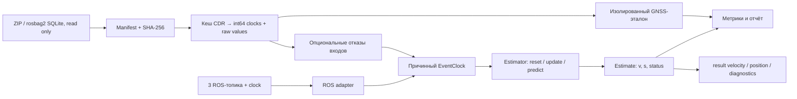

# Архитектура среды

## Поток данных

## Модули

| Модуль в `src/tram_lab` | Контракт |
|---|---|
| `types` | Неизменяемые контейнеры `Event`, `Estimate`, протокол `Estimator` |
| `data` | Manifest, группировка SHA-256, выборки, извлечение выбранного bag, чтение CDR, версионированный кеш |
| `signals` | Численные функции; int64 сохраняется до вычитания времён |
| `estimators` | Три ZOH-базы и фабрика подключаемого локального оценивателя |
| `replay` | Общий планировщик событий и тактов |
| `adapters` | Преобразование сообщения в Event без импорта ROS |
| `faults` | Причинные по содержимому искажения входов с отдельным расписанием доставки |
| `metrics` | Единственное место сопоставления предсказаний и GNSS |
| `reporting` | CSV, графики, HTML, сравнение запусков |
| `experiments` | Оркестрация, происхождение данных, ресурсы и артефакты |
| `cli` | Тонкая оболочка над публичными функциями |

ROS-пакет `tram_lab_ros` содержит подписки и издателей. Он импортирует тот же Python-пакет; формул оценки в адаптере нет. Docker содержит инструменты и зависимости, а исходный пакет сообщений поступает из read-only mount при локальной сборке.

## Время и причинность

`stamp_ns` — неизменённое время измерения, `received_ns` — доступность сообщения оценивателю. В офлайн-режиме это SQLite timestamp; в ROS — последнее полученное значение `/clock` на момент callback. `sequence` сохраняет исходный порядок при равной доставке. Эти определения намеренно различают измерение, доставку и время оцениваемого состояния.

`EventClock.push(event)` сначала выдаёт такты **строго раньше** доставки события, затем передаёт разрешённое событие оценивателю. `advance(t)` закрывает границу времени и по умолчанию выдаёт также такт в `t`. Поэтому все события с одинаковым временем обрабатываются до такта с этой меткой. GNSS может продвинуть офлайн-часы, но никогда не передаётся в `Estimator.update`.

ROS-адаптер закрывает только границы `< current_clock`, оставляя текущую границу для входов той же метки. Это добавляет не более одного интервала публикации clock к плановой задержке при регулярном clock. Рекомендуется `ros2 bag play --clock 100`. При замерших часах тактов нет. При откате clock адаптер явно сбрасывает состояние и начинает новый эпизод; одиночный обратный header такого сброса не вызывает.

Офлайн-шкала поступления должна быть неубывающей. Отрицательный шаг отклоняется. Сырые заголовки с обратным шагом сохраняются и диагностируются. Возраст по заголовку может быть отрицательным; `future_header` сигнализирует об этом, не превращая такой отсчёт в доступ к ещё не полученному сообщению.

## Состояние базовых оценок

`front`/`rear` требуют первого конечного значения своей тележки; `mean` — обеих. После этого используются последние полученные конечные значения. Нечисловые значения не заменяют состояние и увеличивают счётчик отказов. Путь начинается с нуля в момент первой доступной оценки и далее интегрируется методом трапеций по тактам.

`stale` устанавливается, если максимальный возраст требуемых датчиков по времени поступления **или** по header превышает заданный порог. Устаревшая скорость продолжает удерживаться. Никакого скрытого ограничения ускорения, выбора «здорового» колеса или остановки при нуле здесь нет: это честная база сравнения для будущих моделей.

## Воспроизводимость и изоляция

Ключ декодированного кеша включает SHA-256 SQLite, версию парсера и хеш двух определений `.msg`. Перенос датасета не меняет идентичность содержимого. Manifest и split сохраняются в JSON; группа дубликатов не может попасть в разные выборки. При выборе нескольких имён одного содержимого запуск отклоняется.

Случайные искажения получают явный seed. В текущей версии один и тот же seed используется отдельно на каждом bag; добавление другой поездки в список не меняет её случайные отказы. Метрики и CSV не содержат измерений wall-clock, поэтому сравниваются побайтово. Ресурсные измерения хранятся отдельно.

Офлайн-отчёт не может незаметно заменить master на rover в плохой точке: источник выбирается по наличию потока на уровне bag. Дополнительная маска задаётся конфигурацией и сопровождается исходными метриками. GNSS ни при каких условиях не попадает в объект оценивателя через `replay` или ROS-подписки.

## Добавление следующей модели

1. Реализовать протокол `Estimator` в устанавливаемом модуле. Начинать каждый bag с `reset`; состояние предыдущего bag не переносится.
2. Зарегистрировать фабрику в YAML, передать параметры только через `estimator`.
3. Проверить причинность на синтетических событиях, включая пропуски, поздние headers и повторные timestamps.
4. Сравнить с front/rear/mean на фиксированном split, затем повторить с теми же отказами и seed.
5. Для ROS подключить новую фабрику явным изменением конфигурации адаптера после проверки её ресурсов. В v1 параметр ROS `estimator` выбирает только три базовых режима.

Карта пути, начальная GNSS-выставка и обучение должны стать отдельными компонентами с явными разрешёнными входами. Они не подменяют общий поток событий и не получают доступ к тестовому эталону через оцениватель.
